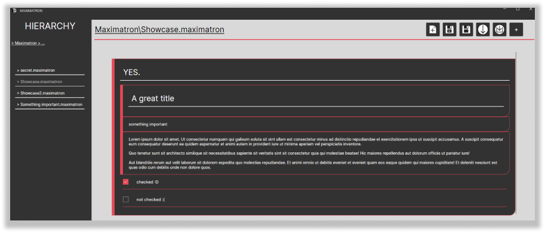
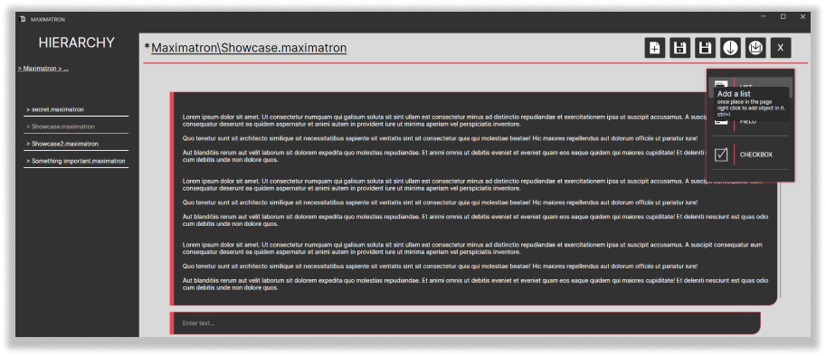

# Maximatron

the maximatron is a very basic note taking app using blocks of notes (list block inside a header block inside another list block...).
the code was created using c# along with dotnet.

## Fetures
- keyboard shortcuts
- hierachy
- file opening
- custom file type
- the app theme around your windows accent color.

## Building

this project is meant to be run and build on windows, you'll need visual studio, and dotnet
to build this project, simply open the visual studio solution and build it in the editor

## Screenshots

